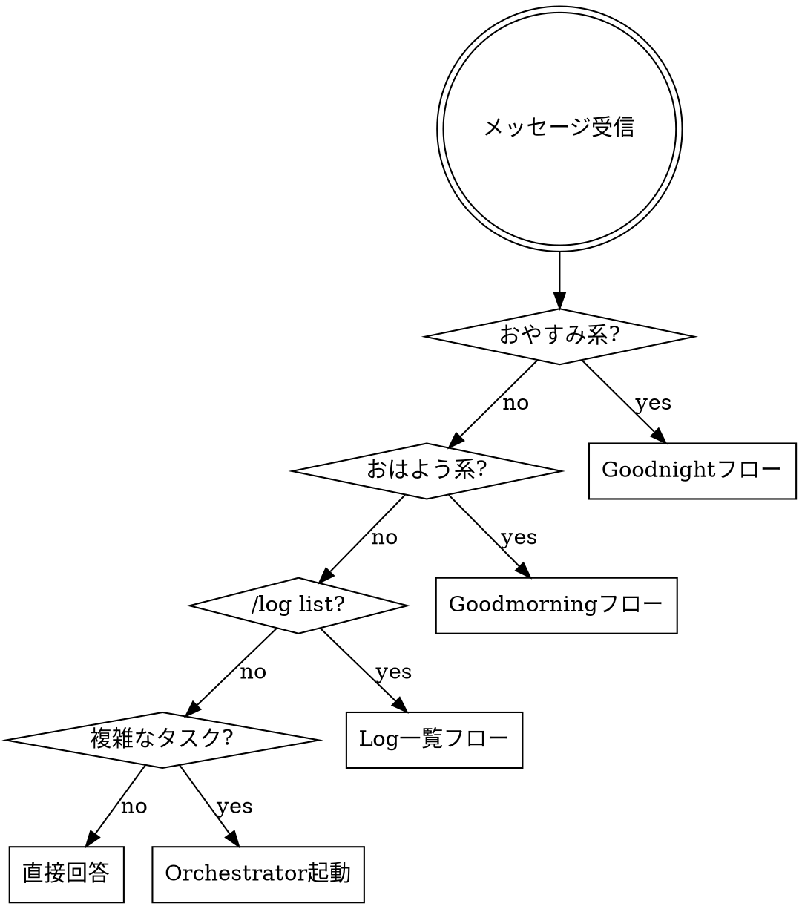

# Secretary ナンバリングスロット機能 実装計画

> **For agentic workers:** REQUIRED SUB-SKILL: Use superpowers:subagent-driven-development (recommended) or superpowers:executing-plans to implement this plan task-by-task. Steps use checkbox (`- [ ]`) syntax for tracking.

**Goal:** secretary skillのGoodnightフロー・Goodmorningフローに番号（スロット）指定を追加し、複数の並行作業コンテキストを独立して保存・復元できるようにする。

**Architecture:** `/home/adachi/.claude/skills/secretary/SKILL.md` の1ファイルのみを変更する。トリガー検出セクションに番号あり形式を追加し、各フローに番号あり時の動作を追記する。`/log list` コマンドも同ファイルに追記する。

**Tech Stack:** Markdown（SKILL.md）、Bash（ファイル操作コマンド）

**Spec:** `docs/superpowers/specs/2026-03-26-secretary-numbered-slots-design.md`

---

## 変更対象ファイル

- Modify: `/home/adachi/.claude/skills/secretary/SKILL.md`

---

### Task 1: おやすみ系トリガーに番号あり検出を追加

**Files:**
- Modify: `/home/adachi/.claude/skills/secretary/SKILL.md`

- [ ] **Step 1: SKILL.md の「おやすみ系トリガー」セクションに番号あり検出を追記する**

「おやすみ系トリガー」セクションを以下のように変更する:

```markdown
## おやすみ系トリガー

以下を含む（大文字小文字・表記ゆれ問わず）:
- おやすみ、おやすみなさい、おやすみ〜
- 寝ます、寝る、終わります、終わりにします
- good night、goodnight
- GreenApple、greenapple、green apple

→ Goodnightフローを実行する（下記参照）

### おやすみ番号ありトリガー

上記トリガーの直後に数字（半角・全角）が続く場合は番号ありとして検出する:
- `おやすみ1`、`おやすみ２`、`おやすみなさい3`、`good night 1`、`goodnight2` など
- 全角数字は半角に正規化する（例: `１` → `1`）
- 0が指定された場合はエラー: 「スロット番号は1以上の整数を指定してください。」と伝えて終了

→ Goodnight番号ありフローを実行する（下記参照）
```

- [ ] **Step 2: 「Goodnightフロー」セクションの直後に「Goodnight番号ありフロー」セクションを追記する**

```markdown
## Goodnight番号ありフロー（`おやすみN`）

1. スロット番号 N を取得する（入力から数字部分を抽出、全角は半角に正規化）
2. `/var/www/html/OutputFromClaude/goodnight_log/latest_N.md` が存在すれば、`YYYY-MM-DD_HH-MM_N.md` としてコピーしてアーカイブする
3. セッション内容を `latest_N.md` に保存（フォーマットは既存の `latest.md` と同一）
4. decisions.md への追記: 番号なしフローと同様に、セッション中の重要な判断があれば追記する
5. アーカイブ保持ポリシー: 番号ありアーカイブで7日以上経過したものを削除
   - `find /var/www/html/OutputFromClaude/goodnight_log -name "????-??-??_??-??_*.md" -mtime +7 -delete`
   - 注: 番号なしアーカイブは既存の削除コマンドで別途管理される
   - 削除したファイルがあれば「古いログ N件を削除しました」と伝える
6. 「お疲れ様でした。スロットNにセッションログを保存しました。」と伝える
```

- [ ] **Step 3: 動作確認（手動）**

テスト入力: `おやすみ1` と送信して以下を確認する:
- スロット番号 1 が検出されること
- `/var/www/html/OutputFromClaude/goodnight_log/latest_1.md` が作成されること
- 「スロット1にセッションログを保存しました。」と表示されること

- [ ] **Step 4: コミット**

```bash
git add /home/adachi/.claude/skills/secretary/SKILL.md
git commit -m "secretary: おやすみ番号ありトリガーとGoodnightスロット保存を追加"
```

---

### Task 2: おはよう系トリガーに番号あり検出を追加

**Files:**
- Modify: `/home/adachi/.claude/skills/secretary/SKILL.md`

- [ ] **Step 1: 「おはよう系トリガー」セクションに番号あり検出を追記する**

「おはよう系トリガー」セクションを以下のように変更する:

```markdown
## おはよう系トリガー

以下を含む（大文字小文字・表記ゆれ問わず）:
- おはよう、おはようございます、おはよ
- 始めます、開始します、再開します
- good morning、goodmorning

→ Goodmorningフローを実行する（下記参照）

### おはよう番号ありトリガー

上記トリガーの直後に数字（半角・全角）が続く場合は番号ありとして検出する:
- `おはよう1`、`おはよう２`、`おはようございます3` など
- 全角数字は半角に正規化する（例: `２` → `2`）
- 0が指定された場合はエラー: 「スロット番号は1以上の整数を指定してください。」と伝えて終了

→ Goodmorning番号ありフローを実行する（下記参照）
```

- [ ] **Step 2: 「Goodmorningフロー」セクションの直後に「Goodmorning番号ありフロー」セクションを追記する**

```markdown
## Goodmorning番号ありフロー（`おはようN`）

1. スロット番号 N を取得する（全角は半角に正規化）
2. `/var/www/html/OutputFromClaude/goodnight_log/latest_N.md` を読み込む
3. `/var/www/html/OutputFromClaude/goodnight_log/decisions.md` が存在すれば読み込む（直近5件程度を参照）
4. ファイルが存在しない場合: 「スロットNのセッションログが見つかりません。新しいタスクから始めましょう。」と伝える
5. ファイルが存在する場合: 以下の形式でブリーフィングする

**ブリーフィング形式（番号あり）:**
```
━━━━━━━━━━━━━━━━━━━━━━━━━━━━
 おはようございます [スロットN]  YYYY-MM-DD(曜)
━━━━━━━━━━━━━━━━━━━━━━━━━━━━

【前回の状態】
ブランチ: <branch名>
作業中: <IN_PROGRESSの内容を具体的に。ファイルパス・次のステップを含む>

【NEXT_ACTIONS（優先順）】
▶ <高優先度タスク>
○ <中優先度タスク>

【未解決の疑問】（あれば）
- <OPEN_QUESTIONSの内容>

【提案】
まず「<NEXT_ACTIONSの1番>」から始めましょう。
━━━━━━━━━━━━━━━━━━━━━━━━━━━━
```
```

- [ ] **Step 3: 動作確認（手動）**

テスト入力: `おはよう1` と送信して以下を確認する:
- Task 1 で保存した `latest_1.md` が読み込まれること
- ブリーフィングのヘッダーに「[スロット1]」が表示されること
- 存在しないスロット番号（例: `おはよう99`）で「見つかりません」メッセージが表示されること

- [ ] **Step 4: コミット**

```bash
git add /home/adachi/.claude/skills/secretary/SKILL.md
git commit -m "secretary: おはよう番号ありトリガーとGoodmorningスロットロードを追加"
```

---

### Task 3: `/log list` コマンドを追加

**Files:**
- Modify: `/home/adachi/.claude/skills/secretary/SKILL.md`

- [ ] **Step 1: ルーティング判断のフローに `/log list` を追加する**

`ルーティング判断` セクションの dot グラフに `/log list` ノードを追加する:

```markdown
## ルーティング判断


```

- [ ] **Step 2: `/log list` トリガーと「Log一覧フロー」セクションを追記する**

既存セクションの末尾（「Orchestratorへの委譲」セクションの前）に追記する:

```markdown
## /log list トリガー

メッセージが `/log list` のみ（前後の空白は無視）の場合に検出する。

→ Log一覧フローを実行する（下記参照）

## Log一覧フロー

1. `/var/www/html/OutputFromClaude/goodnight_log/` 内の `latest*.md` を列挙する
2. ファイルが1件も存在しない場合: 「保存されているセッションログはありません。」と表示して終了
3. 存在するファイルを以下の順で処理する:
   - `latest.md`（デフォルト）を先頭
   - `latest_N.md` をスロット番号の**数値昇順**（辞書順ではなく数値順: 1, 2, 10 の順。欠番はスキップ）
4. 各ファイルから抽出する情報:
   - 保存日時: `# SESSION YYYY-MM-DD HH:MM` から取得（取得できない場合は「不明」）
   - ブランチ名: `branch:` フィールド（存在しない場合は「不明」）
   - ブランチ目的: `branch_purpose:` フィールド（存在しない場合はダッシュ以降を省略）
   - 次のアクション: `## NEXT_ACTIONS` セクションの先頭1件（存在しない場合は「次のアクションなし」）
5. 以下のフォーマットで表示する:

```
━━━━━━━━━━━━━━━━━━━━━━━━━━━━
 セッションログ一覧
━━━━━━━━━━━━━━━━━━━━━━━━━━━━
[デフォルト]  YYYY-MM-DD HH:MM
  ブランチ: <branch名> — <branch_purpose>
  次: <NEXT_ACTIONSの1番>

[スロット1]  YYYY-MM-DD HH:MM
  ブランチ: <branch名> — <branch_purpose>
  次: <NEXT_ACTIONSの1番>
━━━━━━━━━━━━━━━━━━━━━━━━━━━━
```
```

- [ ] **Step 3: 動作確認（手動）**

テスト入力: `/log list` と送信して以下を確認する:
- `latest.md`（デフォルト）と `latest_1.md`（スロット1）が一覧表示されること
- ブランチ名・次のアクションが正しく抽出されること
- 存在しないスロット番号は表示されないこと

- [ ] **Step 4: コミット**

```bash
git add /home/adachi/.claude/skills/secretary/SKILL.md
git commit -m "secretary: /log list コマンドでスロット一覧表示を追加"
```
